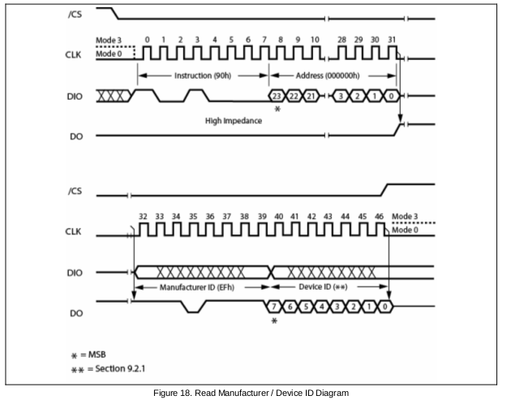
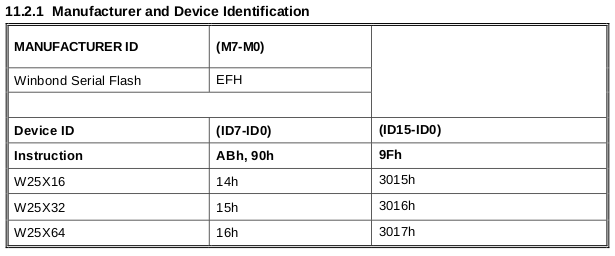

#w25x16 spi flash

W25X16 (16M-bit), W25X32 (32M-bit), 和W25X64 (64M-bit)是 串行Flash存储芯片。可以应用于存储声音，文本和其他数据。使用2.7 ~ 3.6v电压供电。

*更多的详细信息请参考其数据手册*

##步骤

+ 在使用spi传输任何数据之前，建议你使用*spi.init(mode,order,bauddiv)* 初始化一次。在初始化之后，可以使用*spi.info()*查看spi的配置信息。

```lua
spi.init(spi.MODE3,spi.MSBFIRST)
spi.info()
```

+  读芯片ID

读ID地址请参考下面的时序图。




```lua
h=spi.HIGH
l=spi.LOW
first,second=spi.write(l,0x90,0x00,0x00,0x00,-2,h)
if first==0xEF then print("find winband flash chip") end
if second==0x14 then print("w25x16") 
elseif second==0x15 then print("w25x32")
elseif secont==0x16 then print("w25x64")
else print("unknow chip")
end
```
